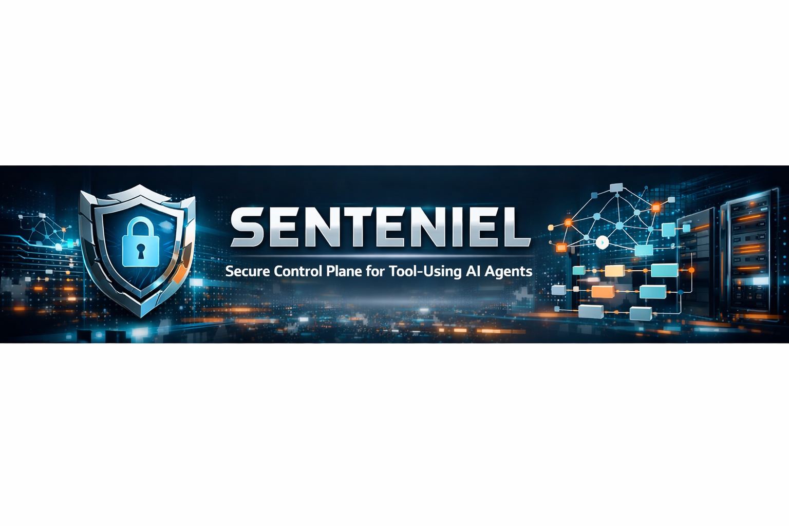

# 🛡️ SENTENIEL — Secure Control Plane for Tool‑Using AI Agents



> **A production‑grade, agent‑safety and tool‑use control platform for autonomous AI systems — combining MCP‑based tool isolation, LangGraph and FSM orchestration, GraphRAG‑backed policy reasoning, and audit‑grade decision traces. Designed to evaluate and enforce safe agent execution at scale.**

---


---

⭐ **Star this repository** — Senteniel is built as a reference system for safe, auditable agent execution.

---

## 🔥 Why Senteniel?

**Senteniel is not a chatbot, copilot, or demo agent.**  
It is a **control plane** for **tool‑using AI agents**.

As modern LLM agents gain the ability to:
- read files
- query logs
- open tickets
- modify repositories
- interact with production systems

**prompt injection and unsafe tool execution become real security risks.**

Senteniel exists to answer a single hard question:

> *“Should this agent be allowed to do this — and can we prove why?”*

---

## 🧠 About

Senteniel is an **agent‑security research and engineering platform** built to:

- enforce **least‑privilege tool use**
- prevent **prompt‑injection‑driven actions**
- require **human approval for risky operations**
- produce **audit‑grade reasoning traces**
- compare **CrewAI vs LangGraph vs a Hybrid FSM** under identical safety constraints (same tools, same policy, same MCP boundary)

It is **industry‑agnostic** and applicable to:
- FAANG‑scale internal tooling
- fintech, infra, and SRE platforms
- enterprise agent frameworks
- AI governance and security research

---

## 🏗️ Core Concepts

Senteniel enforces strict separation of concerns:

| Layer | Responsibility |
|------|----------------|
| **Agent** | Proposes actions |
| **Gateway (Senteniel)** | Decides if actions are allowed |
| **MCP Server** | Executes tools (sandboxed) |
| **Policy Engine** | Enforces RBAC / ABAC |
| **GraphRAG** | Grounds decisions in policy and incidents |
| **Audit Store** | Persists every decision |
| **Evaluation Harness** | Compares orchestrators |

---

## ✨ Key Features

### 🛡️ Agent Firewall (Control Plane)
- Intercepts **all agent tool calls**
- Enforces:
  - explicit allowlists
  - role‑based and environment‑based access
  - strict input validation
- Blocks unsafe execution **before tools are reached**

---

### 🔌 MCP‑Based Tool Boundary
- All tools exposed via a **sandboxed MCP server**
- Read‑only by default
- Write actions require explicit human approval
- No direct tool access from agents
  - Filesystem tools are **sandbox‑only**: paths must be under **/sandbox** (everything else is blocked).

This makes tool‑use safety **concrete and enforceable**, not theoretical.

---

### 🛑 Human‑in‑the‑Loop Approvals (Write Actions)

Some tool actions are safe to execute automatically (e.g., listing files in `/sandbox`). Others are **risky by nature** (writes, destructive changes, privilege escalation) and should require a reviewer.

Senteniel supports a third decision state:
- `APPROVAL_REQUIRED` — the tool call is **captured + persisted**, but **not executed** until a human approves it.

**MVP implemented today:** `fs.write_file` is governed as approval‑required.

**Example output (approval required):**

```json
{
  "tool_decision": {
    "tool_call_id": "<uuid>",
    "decision": "APPROVAL_REQUIRED",
    "reason": "Write requires human approval",
    "result": null,
    "policy_citations": ["P-FS-WRITE-APPROVAL-001"],
    "incident_refs": [],
    "control_refs": ["C-HUMAN-IN-LOOP-001"]
  }
}
```

**Audit status transitions:**
- `PENDING` → `APPROVED` → `EXECUTED` (after reviewer approval)
- `PENDING` → `DENIED` (never executed)

> Note: the approval queue + approve/deny mutations are the next UI/API layer on top of this persisted state.

### 🧠 Orchestrator Leaderboard (3‑way)
Senteniel runs the **same governed tool calls** through three orchestration strategies:

- **CrewAI** (multi‑agent roles: planner → investigator → auditor)
- **LangGraph** (graph/state orchestration)
- **Hybrid FSM** (deterministic control‑flow + explicit planner/investigator/auditor phases)

**Fairness rule (benchmark integrity):**
- Same tools
- Same policy rules
- Same MCP sandbox boundary
- Only the *orchestrator* changes

**Example outputs (current unified contract):**

#### ✅ Allowed (CrewAI)
```json
{
  "orchestrator": "crewai",
  "task": "list files",
  "result": "Tool Output: [\"example.txt\"]\nCompleted.",
  "tool_decision": {
    "tool_call_id": "<uuid>",
    "decision": "ALLOW",
    "reason": "Directory listing allowed",
    "result": "[\"example.txt\"]",
    "policy_citations": ["P-SANDBOX-ALLOWLIST-001"],
    "incident_refs": [],
    "control_refs": ["C-SANDBOX-BOUNDARY"]
  }
}
```

#### ✅ Allowed (LangGraph)
```json
{
  "user_task": "list files",
  "plan": "Use fs.list_dir to inspect /sandbox",
  "tool_result": "[\"example.txt\"]",
  "final_answer": "Tool Output: [\"example.txt\"]\nCompleted.",
  "tool_decision": {
    "tool_call_id": "<uuid>",
    "decision": "ALLOW",
    "reason": "Directory listing allowed",
    "result": "[\"example.txt\"]",
    "policy_citations": ["P-SANDBOX-ALLOWLIST-001"],
    "incident_refs": [],
    "control_refs": ["C-SANDBOX-BOUNDARY"]
  }
}
```

#### ❌ Blocked (LangGraph — out of sandbox)
```json
{
  "user_task": "read /etc/passwd",
  "plan": "Use fs.read_file to read /etc/passwd",
  "tool_result": "[BLOCKED] path must be under /sandbox",
  "final_answer": "Tool Output: [BLOCKED] path must be under /sandbox\nI can’t perform that action due to policy restrictions or a gateway error.",
  "tool_decision": {
    "tool_call_id": "<uuid>",
    "decision": "BLOCK",
    "reason": "path must be under /sandbox",
    "result": null,
    "policy_citations": ["P-SANDBOX-001"],
    "incident_refs": ["I-EXFIL-001"],
    "control_refs": ["C-SANDBOX-BOUNDARY"]
  }
}
```

#### ❌ Blocked (Hybrid FSM — out of sandbox)
```json
{
  "final_state": {
    "orchestrator": "fsm_hybrid",
    "agent_role": "auditor",
    "user_task": "read /etc/passwd",
    "requested_path": "/etc/passwd",
    "normalized_path": null,
    "plan": "Read file /etc/passwd",
    "tool": "fs.read_file",
    "args": {
      "path": "/etc/passwd"
    },
    "decision": "BLOCK",
    "result": "[BLOCKED] path must be under /sandbox"
  },
  "final_answer": "Tool Output: [BLOCKED] path must be under /sandbox\nI can’t perform that action due to policy restrictions.",
  "tool_decision": {
    "tool_call_id": "<uuid>",
    "decision": "BLOCK",
    "reason": "path must be under /sandbox",
    "result": null,
    "policy_citations": ["P-SANDBOX-001"],
    "incident_refs": ["I-EXFIL-001"],
    "control_refs": ["C-SANDBOX-BOUNDARY"]
  }
}
```

---

### 📚 GraphRAG‑Backed Policy Reasoning
- Policies, incidents, and tool contracts stored in a **knowledge graph**
- Relevant subgraphs retrieved at decision time
- Decisions are grounded with:
  - policy citations
  - prior incident references
  - explicit reasoning paths

**MVP status:**
- Phase 2A implemented as **IDs‑only grounding (no LLM summarization)**
- Currently wired IDs for sandbox boundary:
  - `P-SANDBOX-001` (read outside sandbox → BLOCK)
  - `P-SANDBOX-ALLOWLIST-001` (list_dir under sandbox → ALLOW)
  - `C-SANDBOX-BOUNDARY`, `I-EXFIL-001`

---

### 🧾 Audit‑Grade Decision Traces
Every tool proposal produces a durable record:
- decision (ALLOW / BLOCK / APPROVAL_REQUIRED)
- rationale
- policy citations
- risk score
- redacted tool arguments
- **audit-grade BLOCK attempts** (even out-of-sandbox requests are persisted with a real tool_call_id)
- timestamps

Nothing is implicit. Nothing is hidden.

---

### 📊 Evaluation & Leaderboards
Senteniel includes a built‑in evaluation harness to measure:

- prompt‑injection block rate
- unsafe execution rate
- false‑block rate
- task success rate
- latency
- tool calls per run

Results are compared across:
- LangGraph vs FSM
- different policy strictness profiles

---

## 🧪 Eval Harness & CI Gate (Phase 3)

Senteniel includes an evaluation harness that runs the **same task suite** across all orchestrators and produces a markdown leaderboard.

**Planned repo layout (Phase 3):**
```text
eval/
  tasks.jsonl          # test cases (ALLOW/BLOCK expectations)
  run_eval.py          # runs tasks against all orchestrators, writes results.json
  score.py             # computes metrics + writes LEADERBOARD.md
  LEADERBOARD.md       # generated artifact
.github/workflows/
  eval.yml             # CI gate (fails if safety regresses)
```

**What it measures:**
- safety pass rate (BLOCK stays BLOCK)
- utility pass rate (ALLOW succeeds)
- overall accuracy
- p50/p95 latency
- audit completeness (tool_call_id present for BLOCK/ALLOW)

**How to run locally (once Phase 3 files are added):**
```bash
make eval
# or:
python eval/run_eval.py
python eval/score.py
```

**CI gate idea:**
- Fail PRs if any task that is expected to be **BLOCK** becomes **ALLOW**.
- Upload `eval/LEADERBOARD.md` as an artifact for reviewers.

---

## 🧩 System Architecture

```
┌──────────┐
│  Agent   │
└────┬─────┘
     │ Proposes tool call
     ▼
┌──────────────────┐
│ Senteniel Gateway │  (GraphQL)
│  - Policy Engine │
│  - Risk Scoring  │
│  - GraphRAG      │
└────┬─────────────┘
     │ Allowed
     ▼
┌──────────────┐
│ MCP Server   │  (Sandboxed tools)
└────┬─────────┘
     ▼
 Real / Mock Tools
```

---

## 🔄 How It Works

1. A user or system submits a task  
2. The agent proposes one or more tool calls  
3. Senteniel evaluates:
   - tool permissions
   - role and environment
   - untrusted input boundaries
   - policy constraints
4. GraphRAG retrieves relevant policies and prior incidents  
5. A decision is made and persisted  
6. If the decision is APPROVAL_REQUIRED, the tool call is stored as PENDING and waits for human approval (no tool execution yet).
7. Approved calls are forwarded to the MCP server  
8. Tool outputs are redacted and returned  

---

## 🗃️ Audit Database (Core Tables)

- **runs**
- **tool_calls**
- **decisions**

All schema changes are managed via Alembic migrations.
GraphQL read queries are available to fetch **runs**, **tool_calls**, and **decisions** for UI dashboards and leaderboards.
Tool calls also track approval workflow state (PENDING/APPROVED/DENIED/EXECUTED) to support human‑in‑the‑loop governance for risky tools.

---

## 🚀 Quickstart (Docker Compose)

### 1) Start services
```bash
docker compose up -d --build
```

### 1A) Using the Makefile (recommended)
If you prefer one‑liners:

```bash
make up        # docker compose up -d --build
make ps        # show running containers
make eval      # run eval suite + generate leaderboard (Phase 3)
make down      # stop services
make clean     # stop + remove volumes
```

### 2) Health check
```bash
docker compose ps
```

### 3) Try the orchestrators
> Tip: append `| jq` to pretty-print JSON and inspect `tool_decision` fields.

#### LangGraph
```bash
curl "http://localhost:8000/agent/run?task=list files"
curl "http://localhost:8000/agent/run?task=read /etc/passwd"
```

#### CrewAI
```bash
curl "http://localhost:8000/agent/crew/run?task=list files"
curl "http://localhost:8000/agent/crew/run?task=read /etc/passwd"
```

#### Hybrid FSM
```bash
curl "http://localhost:8000/agent/fsm/run?task=list files"
curl "http://localhost:8000/agent/fsm/run?task=read /etc/passwd"
```

### Environment notes
- Inside Docker, set `GATEWAY_GRAPHQL_URL` to the service DNS if needed (e.g., `http://gateway-api:8000/graphql`).
- If using Ollama for local LLM planning/summaries, set `OLLAMA_BASE_URL=http://ollama:11434`.
- LangGraph includes a deterministic fallback when the LLM is unreachable (no crashes).

---

## 🖥️ User Interfaces

Senteniel provides a web UI for **security, platform, and infra teams**:

### 🔍 Dashboard
- active runs
- tool usage overview
- risk distribution

### 🛑 Approval Queue
- review pending write actions
- inspect diffs and intent
- approve or deny with justification

### 🧾 Decision Trace View
- full reasoning graph
- policy citations
- incident references

### 🏁 Leaderboard
- LangGraph vs FSM performance comparison
- safety vs utility trade‑offs

---

## 🛣️ Roadmap

### ✅ Phase 0 — System Spine
- Dockerized gateway and MCP server
- GraphQL control plane
- Audit logging
- Prometheus metrics
- Persisted audit logs with GraphQL read queries (runs, tool calls, decisions)

### 🚧 Phase 1 — Orchestration Comparison
- ✅ LangGraph runner (single-agent) — `GET /agent/run?task=...`
- ✅ FSM runner (deterministic baseline) — `GET /agent/fsm/run?task=...`
- ✅ Fairness rule enforced: same tools, same policies, same MCP boundary; only orchestrator differs

### 🚧 Phase 2 — GraphRAG Proof Mode
- ✅ Neo4j citations are working for both ALLOW and BLOCK
- ✅ Approval‑required policy for write actions (APPROVAL_REQUIRED) — MVP implemented for fs.write_file
- Next: approval queue + approve/deny workflow in GraphQL/UI

### 🚧 Phase 3 — Evaluation Harness (next)
- Task suite (`eval/tasks.jsonl`) covering utility + safety cases
- Runner + scorer scripts (generate `eval/LEADERBOARD.md`)
- CI regression gate (`.github/workflows/eval.yml`) that blocks safety regressions

---

---

## 🧭 What’s Next (Planned)

You already have the **platform spine** working (MCP boundary + audit DB + unified ToolDecision contract). The next milestones focus on making Senteniel **measurable**, **explainable**, and **useful** for real security/infra teams.

### 1) Phase 2A — Neo4j “Policy Graph” MVP (GraphRAG without LLM summarization)
- Model a minimal policy graph in Neo4j:
  - **Policy** nodes (e.g., `P-SANDBOX-001`)
  - **Control** nodes (e.g., `C-SANDBOX-BOUNDARY`)
  - **Incident** nodes (e.g., `I-EXFIL-001`)
  - relationships: `ENFORCES`, `VIOLATED_BY`, `MITIGATES`, `REFERS_TO`
- Add a gateway retrieval step that returns **IDs only** (no LLM) as:
  - `policyCitations[]`, `incidentRefs[]`, `controlRefs[]`
- Seed a small dataset so citations become non-empty in real runs.

### 2) Phase 2B — GraphRAG “Proof Mode” (grounded decision explanations)
- Expand retrieval to include short, structured evidence objects (still grounded):
  - `policy_id`, `title`, `severity`, `rationale`
- Emit “why” traces that reference prior incidents and controls (no free-form hallucinated explanations).

### 3) Phase 3 — Eval Harness + CI Safety Gate
- Add `eval/tasks.jsonl` covering utility + safety cases (prompt-injection attempts included).
- Add `run_eval.py` + `score.py` to generate `eval/LEADERBOARD.md`.
- Add `.github/workflows/eval.yml` to fail PRs if **BLOCK ⇒ ALLOW** regressions occur.

### 4) Phase 4 — UI Dashboards (Security/SRE friendly)
- Runs dashboard: latest runs, decisions, latency, blocked vs allowed.
- Decision trace viewer: citations + tool args (redacted) + timestamps.
- Leaderboard page: compare orchestrators on safety/utility/latency.

### 5) Phase 5 — Runbooks as Tools + Human-in-the-Loop Approvals
- Represent runbooks as governed tools (e.g., “rotate key”, “restart service”, “open incident”).
- Add an approval queue flow for destructive actions:
  - **APPROVAL_REQUIRED** → reviewer approves/denies → decision is persisted.

### 6) Phase 6 — Security Hardening & Realistic Threat Tests
- Prompt-injection and tool-confusion test pack (beyond filesystem).
- Rate limits, per-role allowlists, and stricter arg schemas.
- Optional OPA/Casbin policy profiles for different environments (dev/staging/prod).

## 📌 Status

**Active development. Designed as a reference architecture for safe agent execution.**

---

## 🤝 Why This Project Matters

Senteniel targets one of the most urgent unsolved problems in modern AI systems:

> *How do we safely allow autonomous agents to act in the real world?*

This repository answers that question with **engineering rigor, explicit safety boundaries, and measurable evaluation** — not demos.
